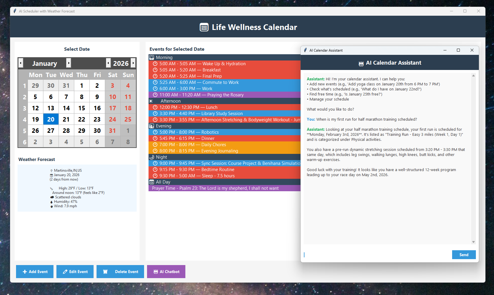

# 📅 Life Wellness Calendar

A simple calendar application to organize your life across four areas: Spiritual, Physical, Emotional, and Intellectual.



## ⚠️ Windows Only

This application works on Windows computers only (Windows 10 or 11).

---

## Getting Started

### What You'll Need:
- Windows computer
- Internet connection
- 10 minutes for setup

---

## Setup Instructions

### Step 1: Download the App

1. Click the green "Code" button at the top of this page
2. Click "Download ZIP"
3. Open your Downloads folder
4. Right-click the ZIP file and select "Extract All"
5. Save it somewhere easy to find (your Desktop works well)

### Step 2: Get Your API Keys

API keys are free passwords that let the app show weather and use AI features.

#### Weather Key (OpenWeather):

1. Visit: https://openweathermap.org/api
2. Click "Sign Up" 
3. Fill out the form with your email
4. Check your email and click the confirmation link
5. Log in to OpenWeather
6. Click "API keys" 
7. Copy the key (it looks like random letters and numbers)
8. **Paste it into Notepad and save for Step 3**

#### AI Key (Anthropic):

1. Visit: https://console.anthropic.com/
2. Click "Sign Up"
3. Create an account
4. Click "API Keys" on the left side
5. Click "Create Key"
6. Name it "Calendar App"
7. Copy the key (starts with `sk-ant-`)
8. **Paste it into Notepad and save for Step 3**

*Note: Anthropic gives you $5 free credit. This app uses pennies per use, so it will last a long time.*

### Step 3: Create Your Settings File

1. Open Notepad (search for "Notepad" in your Windows search bar)
2. Type the following, replacing the parts after the `=` with your actual keys:

```
ANTHROPIC_API_KEY=sk-ant-your-key-here
OPENWEATHER_API_KEY=your-weather-key-here
WEATHER_LOCATION=Martinsville,IN,US
```

**Example:**
```
ANTHROPIC_API_KEY=sk-ant-abc123xyz789
OPENWEATHER_API_KEY=a1b2c3d4e5f6g7h8
WEATHER_LOCATION=Chicago,IL,US
```

3. Change the location to your city if needed
4. Click File → Save As
5. Go to the folder where you extracted the app
6. In "File name" box, type: `.env` 
7. In "Save as type" dropdown, select "All Files"
8. Click Save

**Important:** The file name must be `.env` exactly - not `.env.txt`

### Step 4: Run the App

1. Find `LifeWellnessCalendar.exe` in your extracted folder
2. Double-click it
3. If Windows asks "Do you want to run this?", click Yes
4. The app should open

### Step 5: Make a Desktop Shortcut

1. Right-click `LifeWellnessCalendar.exe`
2. Select "Send to" → "Desktop (create shortcut)"
3. Now you can open it from your desktop

---

## Using the Calendar

### Add an Event:

1. Click a date on the calendar
2. Click "➕ Add Event"
3. Enter the event name
4. Enter start and end times if you want (like "2:30 PM" and "3:30 PM")
5. Pick a category:
   - **Spiritual** - Purple (prayer, meditation, church)
   - **Physical** - Red (exercise, doctor visits)
   - **Emotional** - Orange (therapy, journaling)
   - **Intellectual** - Blue (classes, reading)
6. Click "Save Event"

### View Events:

- Click any date to see what's scheduled
- Events are organized by time of day
- Colors show the category

### Check Weather:

- Click a date to see the weather forecast
- Works for today and the next 5 days

### Use the AI Assistant:

- Click "🤖 AI Chatbot"
- Type questions like:
  - "What's on my schedule for January 25th?"
  - "Add dentist appointment on Monday at 2 PM"
  - "Am I free on Friday?"

---

## Problems?

### App won't open:
- Make sure the `.env` file is in the same folder as the .exe
- Make sure the `.env` file doesn't have `.txt` at the end
- Right-click the .exe and select "Run as Administrator"

### No weather showing:
- Check your OpenWeather API key is copied correctly
- Confirm your OpenWeather email (check spam folder)
- Wait 10 minutes after creating your account

### AI chatbot error:
- Check your Anthropic API key is correct
- Make sure it starts with `sk-ant-`

### Can't create .env file:
- In Notepad, use "Save as type: All Files" not "Text Documents"
- The file must be named `.env` with the dot at the beginning
- Place it in the same folder as the .exe file

---

## Privacy

- Your calendar stays on your computer (saved as `calendar_data.json`)
- Your API keys are private - don't share them with anyone
- The app only connects to the internet to get weather and when you use the AI chatbot

---

## Questions?

If you need help, contact me directly.

Enjoy your new calendar! 📅